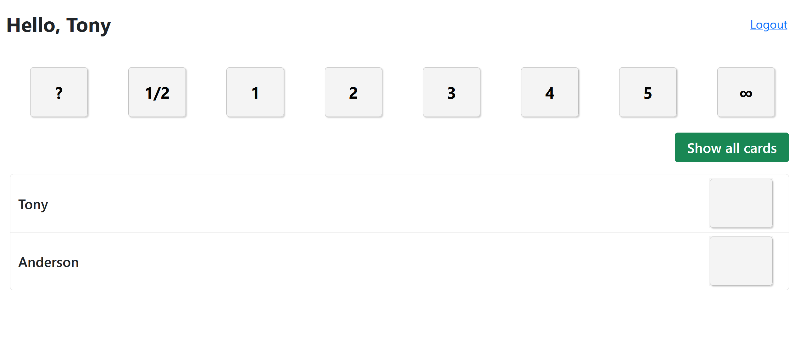

# Planning Poker



> O projeto serve para se realizar planning poker com a equipe, conectando diferentes máquinas em uma mesma sessão

### Ajustes e melhorias

O projeto ainda está em desenvolvimento e as próximas atualizações serão voltadas nas seguintes tarefas:

- [ ] Otimização da quantidade de requisições
- [ ] Painel para administração de usuários
- [ ] Múltiplas sessões ao mesmo tempo
- [ ] Adição de senha as sessões

## 💻 Pré-requisitos

Antes de começar, verifique se você atendeu aos seguintes requisitos:

* Você instalou a versão 2.2^ do `composer`.
* Você possui acesso a um banco de dados `MySQL / PostgreSQL / SQLite / SQL Server`.
* Você tem uma máquina `Windows / Linux / Mac`.
* Você leu o `README`.

## 🚀 Instalando Planning Poker

Para instalar o Planning Poker, siga estas etapas:

Linux, macOS e Windows:
```
composer install
cp .env.example .env
```

Configure seu arquivo `.env` de acordo com suas preferências

```
php artisan migrate --seed
```

## ☕ Usando Planning Poker

Para usar Planning Poker, siga estas etapas:

```
Como ainda não existe um painel você pode configurar os usuários no arquivo `DatabaseSeeder.php`
ou via terminal utilizando o `php artisan tinker`
```
